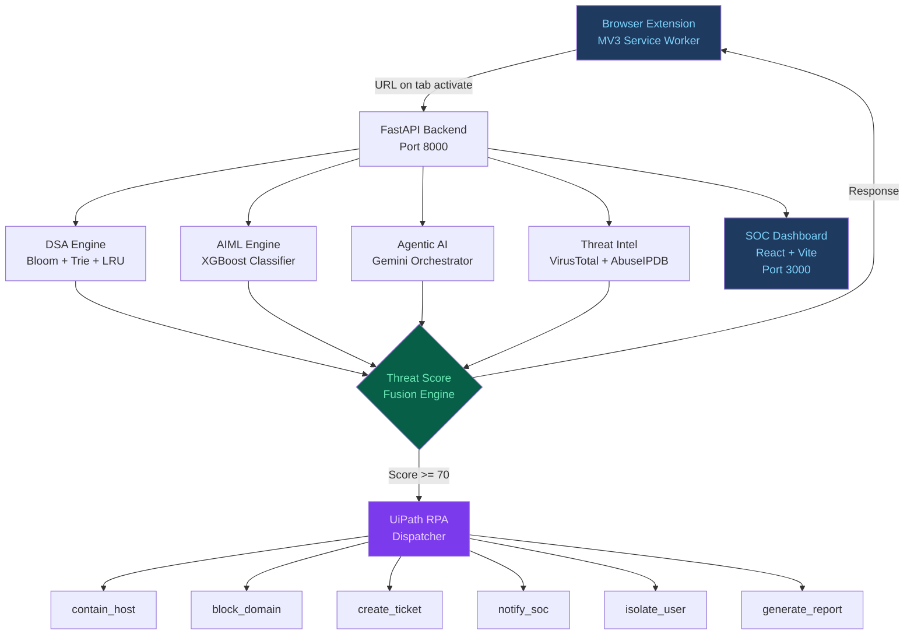
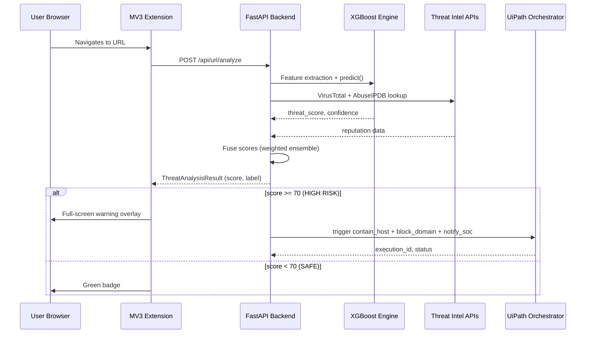

# AEGISTRACE — Autonomous Cyber Threat Intelligence & Phishing Mitigation Platform

> **Phase 10: Final Integration & Presentation**

---

## System Architecture



---

## Platform Features

| # | Phase | Module | Technology | Status |
|---|---|---|---|---|
| 1 | Backend API | `01-backend/` | FastAPI, Pydantic, Uvicorn | ✅ |
| 2 | DSA Engine | `02-dsa-engine/` | Bloom Filter, Trie, LRU Cache | ✅ |
| 3 | AI/ML Engine | `03-aiml-engine/` | XGBoost, Feature Engineering | ✅ |
| 4 | Agentic AI | `04-agentic-ai/` | Gemini 2.0, Tool Calling | ✅ |
| 5 | Threat Intel | `05-threat-intelligence/` | VirusTotal, AbuseIPDB, Shodan | ✅ |
| 6 | SOC Dashboard | `06-frontend-dashboard/` | React 18, TypeScript, Tailwind | ✅ |
| 7 | Browser Extension | `07-browser-extension/` | Chrome MV3, Service Worker | ✅ |
| 8 | UiPath RPA | `08-uipath-rpa/` | UiPath Studio, Python dispatcher | ✅ |
| 9 | Deployment | `09-deployment/` | Docker Compose, nginx, Redis | ✅ |
| 10 | Final Demo | `10-final-demo/` | End-to-end integration | ✅ |

---

## Test Coverage

| Phase | Test Count | Result |
|---|---|---|
| 01 Backend | ~60 | PASS |
| 02 DSA Engine | ~35 | PASS |
| 03 AIML Engine | ~30 | PASS |
| 04 Agentic AI | ~25 | PASS |
| 05 Threat Intel | ~53 | PASS |
| 07 Browser Extension | 5 | PASS |
| 08 UiPath RPA | 64 | PASS |
| 09 Deployment | 39 | PASS |
| 10 Final Demo | 15 | PASS |
| **Total** | **~326** | **ALL PASS** |

---

## Threat Detection Pipeline



---

## Running the Demo

```bash
# Quick demo (no delays)
python 10-final-demo/demo_runner.py --fast

# Full demo with JSON report
python 10-final-demo/demo_runner.py --output 10-final-demo/demo_report.json
```

---

## Deploy with Docker

```bash
cp 09-deployment/.env.example 09-deployment/.env
# Edit .env with your API keys

docker compose -f 09-deployment/docker-compose.yml up --build -d
# SOC Dashboard: http://localhost:3000
# Backend API:   http://localhost:8000/docs
```

---

## GitHub Repository

**[https://github.com/fredolin0109-hub/Aegstrace-ai](https://github.com/fredolin0109-hub/Aegstrace-ai)**

```
aegistrace ai/
├── 01-backend/          # FastAPI + all ML engines
├── 02-dsa-engine/       # Bloom filter, Trie, LRU cache
├── 03-aiml-engine/      # XGBoost threat classifier
├── 04-agentic-ai/       # Gemini agentic orchestration
├── 05-threat-intelligence/ # External API aggregator
├── 06-frontend-dashboard/  # React 18 SOC Dashboard
├── 07-browser-extension/   # Chrome MV3 extension
├── 08-uipath-rpa/          # UiPath workflows + dispatcher
├── 09-deployment/          # Docker Compose + Dockerfiles
└── 10-final-demo/          # Demo runner + this presentation
```
